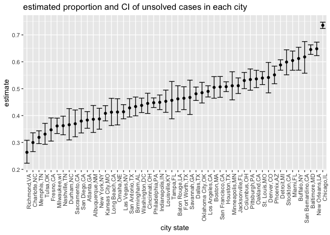
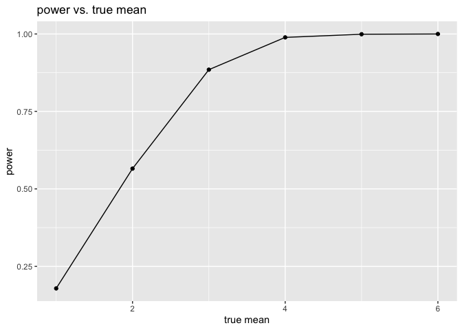
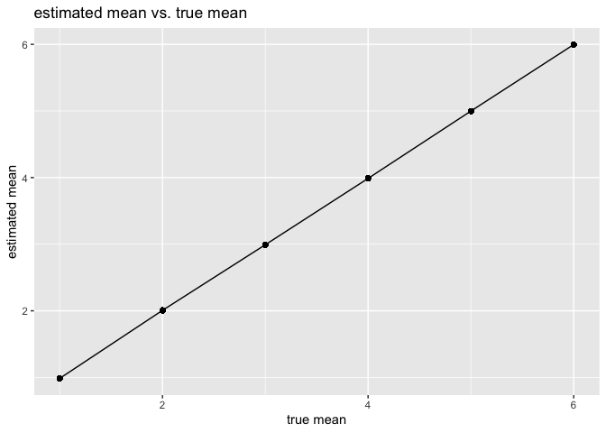
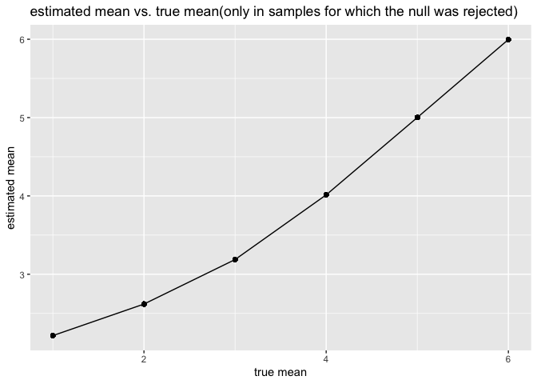

p8105_hw5_sk5152
================
Shuting Kang
2022-11-15

## Problem 2

The homicide datasets in 50 large U.S. cities from Washington Post are
loaded in this project.

``` r
#for loop (map are better actually)
library(tidyverse)
```

    ## ── Attaching packages ─────────────────────────────────────── tidyverse 1.3.2 ──
    ## ✔ ggplot2 3.3.6      ✔ purrr   0.3.5 
    ## ✔ tibble  3.1.8      ✔ dplyr   1.0.10
    ## ✔ tidyr   1.2.0      ✔ stringr 1.4.1 
    ## ✔ readr   2.1.2      ✔ forcats 0.5.2 
    ## ── Conflicts ────────────────────────────────────────── tidyverse_conflicts() ──
    ## ✖ dplyr::filter() masks stats::filter()
    ## ✖ dplyr::lag()    masks stats::lag()

``` r
homicide<-read_csv("./data/homicide-data.csv")
```

    ## Rows: 52179 Columns: 12
    ## ── Column specification ────────────────────────────────────────────────────────
    ## Delimiter: ","
    ## chr (9): uid, victim_last, victim_first, victim_race, victim_age, victim_sex...
    ## dbl (3): reported_date, lat, lon
    ## 
    ## ℹ Use `spec()` to retrieve the full column specification for this data.
    ## ℹ Specify the column types or set `show_col_types = FALSE` to quiet this message.

``` r
head(homicide)
```

    ## # A tibble: 6 × 12
    ##   uid    repor…¹ victi…² victi…³ victi…⁴ victi…⁵ victi…⁶ city  state   lat   lon
    ##   <chr>    <dbl> <chr>   <chr>   <chr>   <chr>   <chr>   <chr> <chr> <dbl> <dbl>
    ## 1 Alb-0…  2.01e7 GARCIA  JUAN    Hispan… 78      Male    Albu… NM     35.1 -107.
    ## 2 Alb-0…  2.01e7 MONTOYA CAMERON Hispan… 17      Male    Albu… NM     35.1 -107.
    ## 3 Alb-0…  2.01e7 SATTER… VIVIANA White   15      Female  Albu… NM     35.1 -107.
    ## 4 Alb-0…  2.01e7 MENDIO… CARLOS  Hispan… 32      Male    Albu… NM     35.1 -107.
    ## 5 Alb-0…  2.01e7 MULA    VIVIAN  White   72      Female  Albu… NM     35.1 -107.
    ## 6 Alb-0…  2.01e7 BOOK    GERALD… White   91      Female  Albu… NM     35.2 -107.
    ## # … with 1 more variable: disposition <chr>, and abbreviated variable names
    ## #   ¹​reported_date, ²​victim_last, ³​victim_first, ⁴​victim_race, ⁵​victim_age,
    ## #   ⁶​victim_sex

``` r
skimr::skim(homicide)
```

|                                                  |          |
|:-------------------------------------------------|:---------|
| Name                                             | homicide |
| Number of rows                                   | 52179    |
| Number of columns                                | 12       |
| \_\_\_\_\_\_\_\_\_\_\_\_\_\_\_\_\_\_\_\_\_\_\_   |          |
| Column type frequency:                           |          |
| character                                        | 9        |
| numeric                                          | 3        |
| \_\_\_\_\_\_\_\_\_\_\_\_\_\_\_\_\_\_\_\_\_\_\_\_ |          |
| Group variables                                  | None     |

Data summary

**Variable type: character**

| skim_variable | n_missing | complete_rate | min | max | empty | n_unique | whitespace |
|:--------------|----------:|--------------:|----:|----:|------:|---------:|-----------:|
| uid           |         0 |             1 |   9 |  10 |     0 |    52179 |          0 |
| victim_last   |         0 |             1 |   1 |  20 |     0 |    12687 |          0 |
| victim_first  |         0 |             1 |   1 |  28 |     0 |    16640 |          0 |
| victim_race   |         0 |             1 |   5 |   8 |     0 |        6 |          0 |
| victim_age    |         0 |             1 |   1 |   7 |     0 |      102 |          0 |
| victim_sex    |         0 |             1 |   4 |   7 |     0 |        3 |          0 |
| city          |         0 |             1 |   5 |  14 |     0 |       50 |          0 |
| state         |         0 |             1 |   2 |   2 |     0 |       28 |          0 |
| disposition   |         0 |             1 |  14 |  21 |     0 |        3 |          0 |

**Variable type: numeric**

| skim_variable | n_missing | complete_rate |        mean |         sd |          p0 |         p25 |         p50 |         p75 |          p100 | hist  |
|:--------------|----------:|--------------:|------------:|-----------:|------------:|------------:|------------:|------------:|--------------:|:------|
| reported_date |         0 |             1 | 20130899.16 | 1123419.63 | 20070101.00 | 20100318.00 | 20121216.00 | 20150911.00 | 201511105\.00 | ▇▁▁▁▁ |
| lat           |        60 |             1 |       37.03 |       4.35 |       25.73 |       33.77 |       38.52 |       40.03 |         45.05 | ▁▅▅▇▅ |
| lon           |        60 |             1 |      -91.47 |      13.75 |     -122.51 |      -96.00 |      -87.71 |      -81.76 |        -71.01 | ▃▁▃▇▅ |

``` r
homicide_CityState<- homicide%>%
  mutate(city_state=str_c(city,state,sep=","))
head(homicide_CityState)
```

    ## # A tibble: 6 × 13
    ##   uid    repor…¹ victi…² victi…³ victi…⁴ victi…⁵ victi…⁶ city  state   lat   lon
    ##   <chr>    <dbl> <chr>   <chr>   <chr>   <chr>   <chr>   <chr> <chr> <dbl> <dbl>
    ## 1 Alb-0…  2.01e7 GARCIA  JUAN    Hispan… 78      Male    Albu… NM     35.1 -107.
    ## 2 Alb-0…  2.01e7 MONTOYA CAMERON Hispan… 17      Male    Albu… NM     35.1 -107.
    ## 3 Alb-0…  2.01e7 SATTER… VIVIANA White   15      Female  Albu… NM     35.1 -107.
    ## 4 Alb-0…  2.01e7 MENDIO… CARLOS  Hispan… 32      Male    Albu… NM     35.1 -107.
    ## 5 Alb-0…  2.01e7 MULA    VIVIAN  White   72      Female  Albu… NM     35.1 -107.
    ## 6 Alb-0…  2.01e7 BOOK    GERALD… White   91      Female  Albu… NM     35.2 -107.
    ## # … with 2 more variables: disposition <chr>, city_state <chr>, and abbreviated
    ## #   variable names ¹​reported_date, ²​victim_last, ³​victim_first, ⁴​victim_race,
    ## #   ⁵​victim_age, ⁶​victim_sex

The homicides dataset contained 52179 observation and 12 variables. I
excluded Tulsa, AL, because Tulsa,AL only have one record, which is
consider as outlier.

``` r
summary<-homicide_CityState%>%
  group_by(city_state)%>%
  summarize(
    total_cases=n(),
    solved=sum(disposition=="Closed by arrest"),
    unsolved=sum(disposition!="Closed by arrest")
  )%>%
  filter(city_state!="Tulsa,AL")
summary
```

    ## # A tibble: 50 × 4
    ##    city_state     total_cases solved unsolved
    ##    <chr>                <int>  <int>    <int>
    ##  1 Albuquerque,NM         378    232      146
    ##  2 Atlanta,GA             973    600      373
    ##  3 Baltimore,MD          2827   1002     1825
    ##  4 Baton Rouge,LA         424    228      196
    ##  5 Birmingham,AL          800    453      347
    ##  6 Boston,MA              614    304      310
    ##  7 Buffalo,NY             521    202      319
    ##  8 Charlotte,NC           687    481      206
    ##  9 Chicago,IL            5535   1462     4073
    ## 10 Cincinnati,OH          694    385      309
    ## # … with 40 more rows

For the city of Baltimore, MD, prop.test function was utilized to
estimate the proportion of homicides that are unsolved. broom::tidy was
applied to save the output of prop.test as an R object. The test method
is 1-sample proportions test with continuity correction, the estimated
proportion is 0.6455607, and the 95% confidence interval is
(0.6275625,0.6631599)

``` r
baltimore<-
  homicide_CityState%>%
  filter(city_state=="Baltimore,MD")%>%
  summarize(
    unsolved=sum(disposition!="Closed by arrest"),
    total_cases=n()
  )


baltimore_test <-prop.test(x=1825   ,n=2827 )%>%
  broom::tidy()
baltimore_test
```

    ## # A tibble: 1 × 8
    ##   estimate statistic  p.value parameter conf.low conf.high method        alter…¹
    ##      <dbl>     <dbl>    <dbl>     <int>    <dbl>     <dbl> <chr>         <chr>  
    ## 1    0.646      239. 6.46e-54         1    0.628     0.663 1-sample pro… two.si…
    ## # … with abbreviated variable name ¹​alternative

``` r
result=
  summary%>%
  mutate(
    result=map2(unsolved,total_cases,prop.test),
    output_result=map(result, broom::tidy)
  )%>%
  unnest(output_result)%>%
  select(city_state,estimate,conf.low,conf.high)

result
```

    ## # A tibble: 50 × 4
    ##    city_state     estimate conf.low conf.high
    ##    <chr>             <dbl>    <dbl>     <dbl>
    ##  1 Albuquerque,NM    0.386    0.337     0.438
    ##  2 Atlanta,GA        0.383    0.353     0.415
    ##  3 Baltimore,MD      0.646    0.628     0.663
    ##  4 Baton Rouge,LA    0.462    0.414     0.511
    ##  5 Birmingham,AL     0.434    0.399     0.469
    ##  6 Boston,MA         0.505    0.465     0.545
    ##  7 Buffalo,NY        0.612    0.569     0.654
    ##  8 Charlotte,NC      0.300    0.266     0.336
    ##  9 Chicago,IL        0.736    0.724     0.747
    ## 10 Cincinnati,OH     0.445    0.408     0.483
    ## # … with 40 more rows

I create a tidy dataframe with estimated proportions of CIs for each
city based on the summary table, generated above, which contain
city_state, the number of unsolved, solved, and total cases for each
city. prop.test was utilized to analyze the estimated proportion
unsolved cases and distinguish CI for each city. purrr::map and
purrr::map2 were used to generate a tidy pipeline. finally, I use unnest
function to pick the target variables, included estimated proportion,
confidence interval boundary for each city.

``` r
city_plot = 
result %>% 
ggplot(aes(x=fct_reorder(city_state,estimate), y=estimate))+
  geom_point()+
  geom_errorbar(aes(ymin=conf.low, ymax=conf.high))+
  labs(
    title = "estimated proportion and CI of unsolved cases in each city",
    x = "city state") +
  theme(axis.text.x = element_text(angle = 90, hjust = 1))
city_plot
```

<!-- -->
This plot visualize the estimates and CIs for each city with error bar
based on the upper and lower limits with ascending order.

## Problem 3

First, I build a simulation t-test function for each input true_mean. to
obtain the estimate and p-value, broom::tidy was utilized to clean the
output of t.test.

``` r
library(tidyverse)
sim_t_test=function(true_mean){
  sample=rnorm(30,mean=true_mean,sd=5)
test_results=t.test(sample,conf.level=0.95)
test_results%>%
  broom::tidy()%>%
  select(estimate,p.value)
}
```

set mean=0, generate 5000 datasets from the Normal distribution model
with alpha=0.05

``` r
sim_reuslt_df_0=
  expand_grid(
    true_mean=0,
    iter=1:5000
  )%>%
  mutate(
    estimate=map(true_mean,sim_t_test)
  )%>%
  unnest(estimate)
head(sim_reuslt_df_0)
```

    ## # A tibble: 6 × 4
    ##   true_mean  iter estimate p.value
    ##       <dbl> <int>    <dbl>   <dbl>
    ## 1         0     1  -0.893   0.344 
    ## 2         0     2  -0.0932  0.909 
    ## 3         0     3   0.192   0.851 
    ## 4         0     4   0.165   0.871 
    ## 5         0     5  -1.47    0.0328
    ## 6         0     6   1.18    0.342

repeat the above for mean=1,2,3,4,5,6

``` r
sim_results_df = 
  expand_grid(
    true_mean=1:6,
    iteration=1:5000
  ) %>% 
  mutate(
    estimate_df = map(true_mean,sim_t_test)
  ) %>% 
  unnest(estimate_df)
```

summary table was used to visualize and compare the power between each
true mean. alpha is 0.05, so we consider the p.value lower tha 0.05 as
reject to the null hypothesis. power is reject devided by the total.

``` r
summary = sim_results_df %>% 
  group_by(true_mean)%>%
  summarize(
    total = n(),
    reject = sum(p.value < 0.05)
  ) %>% 
  mutate(
    power = reject / total
  )
summary
```

    ## # A tibble: 6 × 4
    ##   true_mean total reject power
    ##       <int> <int>  <int> <dbl>
    ## 1         1  5000    894 0.179
    ## 2         2  5000   2827 0.565
    ## 3         3  5000   4424 0.885
    ## 4         4  5000   4945 0.989
    ## 5         5  5000   4996 0.999
    ## 6         6  5000   5000 1

Make a plot showing the proportion of times the null was rejected (the
power of the test) on the y axis and the true value of μ on the x axis.
Describe the association between effect size and power.

``` r
summary%>%
  ggplot(aes(x=true_mean,y=power))+
  geom_point()+
  geom_line()+
  labs(title="power vs. true mean",
       x="true mean",
       y="power")
```

<!-- --> as
the true mean increasing from 1 to 6, the power also increased from 0.2
to 1.0 for true mean between the 1 to 5, the power is increasing, and
then, the power keep constant from true mean of 5 to the true mean of 6.

``` r
# average estimate of mean vs true mean
plot2=
  sim_results_df%>%
  group_by(true_mean)%>%
  mutate(estimated_mean=mean(estimate))%>%
  ggplot(aes(x=true_mean,y=estimated_mean))+
  geom_point()+
  geom_line()+
  labs(title="estimated mean vs. true mean",
         x="true mean",
         y="estimated mean")
 plot2 
```

<!-- -->
this plot visualize the average estimate of mean and true mean.

``` r
plot3=
  sim_results_df%>%
  filter(p.value<0.05)%>%
  group_by(true_mean)%>%
  mutate(estimated_mean=mean(estimate))%>%
  ggplot(aes(x=true_mean,y=estimated_mean))+
  geom_point()+
  geom_line()+
  labs(title="estimated mean vs. true mean(only in samples for which the null was rejected)",
         x="true mean",
         y="estimated mean")
 plot3 
```

<!-- -->
the average estimate of mean only in samples for which the null was
rejected on the y axis and the true value of mean on the x axis. the
estimate mean of the samples for which the null was rejected was
generally similiar as the expected estimated mean, especially for the
larger true_mean. when the true mean is small, like 1,2,3, the estimated
mean for rejected null hypothesis is lower than their estimated mean.
